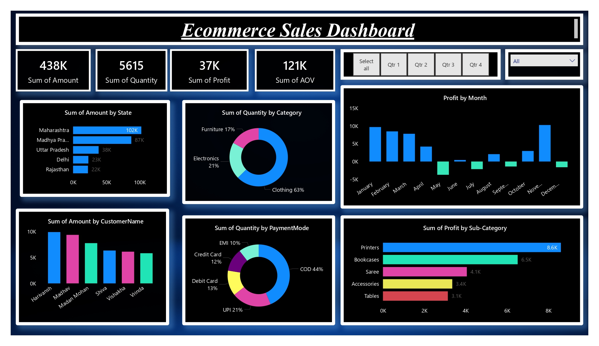

# 📊 E-commerce Sales Dashboard (Power BI)

## 📝 Overview
This project is an **E-commerce Sales Dashboard** built with **Power BI**.  
It provides insights into sales performance, customer behavior, and product trends by analyzing two datasets: **Orders** and **Order Details**.  

The dashboard helps businesses answer key questions like:
- Which products are selling the most?
- How much revenue is generated over time?
- Who are the top customers and regions?
- What is the average order value (AOV)?

---

## 📂 Datasets
1. **Orders.csv** → Order-level information (Order ID, Customer, Date, Region, etc.)  
2. **Details.csv** → Product-level details (Order ID, Product, Quantity, Price, Discount, etc.)  

---

## 🚀 Features & KPIs
✔ **Total Sales** 💰  
✔ **Total Orders** 🛍️  
✔ **Total Quantity Sold** 📦  
✔ **Average Order Value (AOV)** 📈  
✔ **Customer Segmentation by Region** 🌍  
✔ **Monthly & Yearly Sales Trends** 📊  

---

## 🖼️ Dashboard Preview
(Add your screenshots here 👇 after publishing the dashboard)

---

## ⚙️ Tools & Technologies
- **Power BI Desktop** → Data visualization & dashboard building  
- **Power Query** → Data cleaning & transformation (Trim, Clean, Merge)  
- **DAX** → KPIs & time-intelligence calculations  
- **GitHub** → Version control & portfolio showcase  

---

## 📌 Steps in Project
1. Imported CSV files (Orders & Details).  
2. Cleaned data using **Power Query** (Trim, Clean, Remove Nulls).  
3. Built data model (relationship between Orders & Details).  
4. Created DAX measures (Sales, Orders, AOV, MTD, YTD, YoY).  
5. Designed interactive dashboard with slicers & visuals.  
6. Published dashboard to **Power BI Service** and uploaded to **GitHub**.  

---

## 🎯 Business Impact
This dashboard enables businesses to:
- Track overall sales performance.  
- Identify best-selling products and customers.  
- Compare current vs. last year’s growth.  
- Make **data-driven decisions** quickly.  

---

## 👤 Author
👨‍💻 **Rohit Kolage**  
📧 Email: rohitkolage091@gmail.com 
🔗 [LinkedIn](https://www.linkedin.com/in/rohit-kolage-01510226a)  
